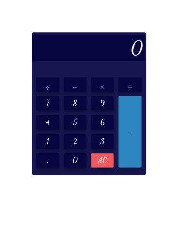

# Javascript Calculator

This is a solution to the [javascript calculator challenge](https://drive.google.com/drive/u/0/folders/12JdcRiWmzxRbowBtO6EyDwpC7ygxjY3Q).

## Table of contents

- [Overview](#overview)
  - [The challenge](#the-challenge)
  - [Screenshot](#screenshot)
  - [Links](#links)
- [My process](#my-process)
  - [Built with](#built-with)
  - [What I learned](#what-i-learned)
  - [Continued development](#continued-development)
  - [Useful resources](#useful-resources)
- [Author](#author)
- [Acknowledgments](#acknowledgments)

## Overview

### The challenge

Users should be able to:

- View the optimal layout for the site depending on their device's screen size
- See hover states for all interactive elements on the page
- Perform calculations including decimal calculations.

### Screenshot



### Links

- Solution URL: [view solution]()
- Live Site URL: [live site]()

## My process

### Built with

- Semantic HTML5 markup
- CSS custom properties
- Flexbox
- CSS Grid
- Mobile-first workflow
- Vanilla Javascript

### What I learned

Use this section to recap over some of your major learnings while working through this project. Writing these out and providing code samples of areas you want to highlight is a great way to reinforce your own knowledge.

To see how you can add code snippets, see below:

```html
<h1>HTML layout of a calculator</h1>
 <button type="button" class="operator" value="-">-</button>

	  <button type="button" class="operator" value="*">&times;</button>

	  <button type="button" class="operator" value="/">&divide;</button>
	  
	  <button type="button" value="7">7</button>
	  <button type="button" value="8">8</button>
	  <button type="button" value="9">9</button>
```
```css
.calculator-keys {
  display: grid;
  grid-template-columns: 1fr 1fr 1fr 1fr;
  grid-gap: 20px;
  padding: 20px;
}
```
```js
const calculator = {
  displayValue: '0',
  firstOperand: null,
  waitingForSecondOperand: false,
  operator: null,
};

 console.log('🎉')
```

### Continued development
I plan to add a toggle dark and light mode feature to this project.
I also plan to implement the sin, cos, tan power and log function to my calculator.

### Useful resources

- [CSS grid](https://freshman.tech/css-grid-calculator/) - This helped me with CSS grid. I really liked this pattern and it's explanatory.
- [Js calculator resources](https://freshman.tech/calculator/) - This is an amazing article which helped me finally understand javascript calculator. I'd recommend it to anyone still learning this concept.

## Author

- Twitter - [@muslimahdev](https://www.twitter.com/muslimahdev)

## Acknowledgments

My appreciation goes to freshman tech resources for this great article on Javascript calculator.
